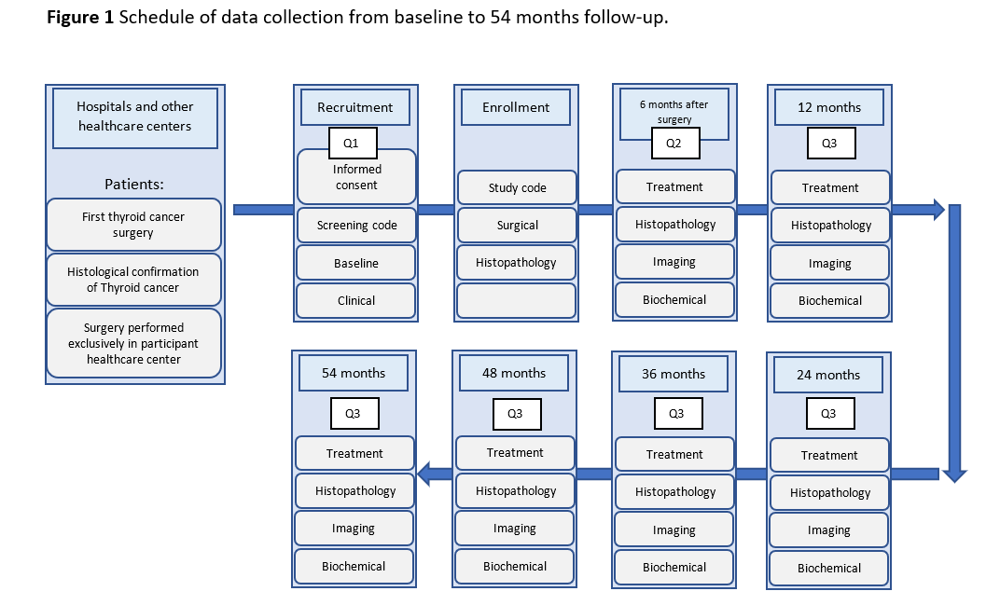

CATALINA PROJECT
================

<i> This project is made by [Luis A.
Figueroa](https://twitter.com/LuisFig1706), [Andrea Solis
Pazmiño](https://x.com/paosolpaz18), [et.
al](https://x.com/CaTaLiNA_Ecu)</i>

This site show all information or documents used, from the protocol to
the final publication, will be available here. If further information is
needed, please do not hesitate to contact us.

<b>Figures </b>

  This section shows [Figures](./Figure%201.docx).

<figure>

<figcaption aria-hidden="true">Figure 1 Schedule of data collection from
baseline to 54 months follow-up.</figcaption>
</figure>

 

<b>Tables </b>

  This section shows [Tables](./TABLES.docx').

**Table 1. Sites of the study**

| ***COUNTRY*** | **CITY** | **HOSPITAL** | **Number of patients per year** |
|:--:|:--:|:--:|:--:|
| *Ecuador* | Quito | Hospital de Especialidades Eugenio Espejo | 200 |
|  |  | SOLCA | 100 |
|  |  | Instituto de la Tiroides y Enfermedades de Cabeza y Cuello | 100 |
|  | Guayaquil | SOLCA | 100 |
|  | Cuenca | SOLCA | 100 |
|  | Ambato | Hospital Regional Ambato | 100 |
| *Peru* | Lima | Hospital Nacional Edgardo Rebagliati Martins | 200 |
| *Uruguay* | Montevideo | Hospital de clínicas Dr. Manuel Quintela | 50 |
| *Mexico* | Monterrey | Hospital Universitario “Dr. José E. González” Universidad Autónoma de Nuevo León | 100 |
|  | Mexico DF | Clinica de Especialidades | 150 |

**Table 2. Description of Questionnaire 1**

| Questionnaire Items | Content |
|:---|:---|
| Demographic characteristics | Age, degree of education, region of residence, age at diagnosis, and ethnicity |
| Past Medical | Family History Containing if relatives up to the second degree of consanguinity have had thyroid cancer or thyroid-related diseases. |
| Environmental risk factors | Describe risk factors such as (smoking, medical comorbidities, and radiation) |
| Methods of diagnosis | Describe different diagnostic methods such as ultrasound, FNA, incidental images, and nodules in physical examination. |
| Thyroid gland functionality and description | Describe the last thyroid function recorded in the patient’s medical care. |
| Description of thyroid nodule fine-needle aspiration (F.N.A.) | Describe cytological results based on the Bethesda System |

**Table 3. Description of Questionnaire 2**

| Sections of the questionnaire | Questionnaire items | Content |
|:---|:---|:---|
| Type of treatment | 2a. Thyroid Surgery | Describe the dates and technical specifications of the proposed treatment in the form. |
|  | 2b. Radiofrequency ablation | Describe the dates and technical specifications of the proposed treatment in the form. |
|  | 2c. Active Surveillance | Describe the dates and technical specifications of the proposed treatment in the form. |
| Histological characteristics | Size, histopathology, and nodal, lymphatic, and vascular invasion. | Describe the measures and detailed characteristics |
| Risk of reference calculators | ATA2, E.T.A. 3, and the C.I.L.A. 4 | Describe the measures and detailed characteristics |
| Treatment complications | Hypercalcemia \< 6 months and \> six months after the procedure, recurrent laryngeal nerve injury, and other complications with active surveillance. | \- |

**Table 4. Description of Questionnaire 3**

| Sections of the Questionnaire | Content |
|:---|:---|
| 1\) D.T.C. markers measured after treatment and before medical therapy. | Thyroid-stimulating hormone (TSH), stimulated thyroglobulin (sTg), inhibited thyroglobulin (iTg), and anti-thyroglobulin antibodies (aTg). |
| Description in detail of medical follow-up | Radioactive iodine treatment, its doses, and scan results. |
| Primary outcome (recurrence) | Describe the measures and detailed characteristics |
| Secondary outcomes (response to the treatment, mortality, and quality of life \[Q.o.L.\]). | Describe the measures and detailed characteristics |

**Table 5. Response to Initial treatment Definitions**

<table>
<colgroup>
<col style="width: 33%" />
<col style="width: 33%" />
<col style="width: 33%" />
</colgroup>
<thead>
<tr class="header">
<th></th>
<th>Patients with TT and I-131</th>
<th>Patients with TT without I-131</th>
</tr>
</thead>
<tbody>
<tr class="odd">
<td><strong>Excellent response</strong></td>
<td>● No abnormal findings on imaging 
● And basal thyroglobulin &lt; 0.2 ng/ml or stimulated thyroglobulin
&lt; 1 ng/ml 
● And negative anti-thyroglobulin antibodies</td>
<td>● No abnormal findings on imaging 
● And basal thyroglobulin &lt; 0.2 ng/ml or stimulated thyroglobulin
&lt; 2 ng/ml 
● And negative anti-thyroglobulin antibodies</td>
</tr>
<tr class="even">
<td><strong>Biochemical incomplete response</strong></td>
<td>● No abnormal findings on imaging 
● And basal thyroglobulin ≥ 1 ng/ml or stimulated thyroglobulin ≥ 10
ng/ml 
● Or increasing anti-thyroglobulin antibodies over time</td>
<td>● No abnormal findings on imaging 
● And basal thyroglobulin &gt; 5 ng/ml or stimulated thyroglobulin &gt;
10 ng/ml or increasing thyroglobulin values over time with stable
TSH 
● Or increasing anti-thyroglobulin antibodies over time</td>
</tr>
<tr class="odd">
<td><strong>Indeterminate response</strong></td>
<td>● Nonspecific findings on imaging 
● And/or basal thyroglobulin ≥ 0.2 to &lt; 1 ng/ml or stimulated
thyroglobulin ≥ 1 to &lt; 10 ng/ml 
● Or stable or declining anti-thyroglobulin antibodies over time</td>
<td>● Nonspecific findings on imaging 
● And/or basal thyroglobulin ≥ 0.2 to &lt; 5 ng/ml or stimulated
thyroglobulin ≥ 2 to &lt; 10 ng/ml 
● Or stable or declining anti-thyroglobulin antibodies over time</td>
</tr>
<tr class="even">
<td><strong>Structural incomplete response</strong></td>
<td>Abnormal findings on imaging</td>
<td>Abnormal findings on imaging</td>
</tr>
</tbody>
</table>

\</\>

<b>Supplementary material </b>

  This section shows [Supplementary
material](./Supplementary%20material.docx).

**Table 1s. Comparison among ATA, ETA and CIA guideline.**

|  | ATA 2015 | ETA 2018 | Consenso Intersocietario Argentino 2022 |
|----|----|----|----|
| Risk Categories | Low / Intermediate / High | Very Low / Low / Intermediate / High | Very Low / Low / Intermediate / High |
| Development | Based on consensus | Based on consensus | Based on consensus |
| Use of Dynamic Risk Stratification | Yes (response to therapy used after initial treatment) | Yes | Yes |
| Do they use or not molecular markers in their risk stratification? | Yes | No | No |
| Clinical and histopathological features | No | No | No |

 
